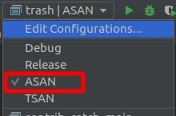

## Tips for passing code-review & contest verification
### Using linters

Before sending code, we recommend checking the code using [clang-format] and [clang-tidy] with configuration files [.clang-format], [.clang-tidy]. In order for the utilities to find the configuration files, it is enough to put them in one of the parent directories or in the current directory. Commands for running utilities:
```
clang-tidy solution.cpp -- -std=c++17
clang-format -i solution.cpp 
```
The same configuration files are used in the context. Note that the configuration files may be updated from time to time.

### Using adress sanitizer
In order to catch memory leaks, array outflows, uninitialized variables, etc., test your program using [adress sanitazer]: 
```
g++ solution.cpp -fsanitize=address,undefined -fno-sanitize-recover=all -std=c++17 -O2 -Wall -Werror -Wsign-compare -o solution
```

### Configuring CLion
[CLion] allows you to automatically run a code check for compliance with the style guide. Moreover, you can run your program using ASAN to check memory-managements bugs.

#### Set up clang-format & clang-tidy
To set up linters, just put the [.clang-format] and [.clang-tidy] configuration files in the project directory, and enable clang-format ("Enable ClangFormat" button in right bottom corner). If there are problems, see [CLion clang-tidy], [CLion clang-format].

#### Set up address sanitizer
- Add the following flags to CMake file:

```cmake
set(CMAKE_CXX_STANDARD 17)

set(CMAKE_CXX_FLAGS "-Wall -Werror -Wsign-compare")

set(CMAKE_CXX_FLAGS_ASAN "-g -fsanitize=address,undefined -fno-sanitize-recover=all"
CACHE STRING "Compiler flags in asan build"
FORCE)
```
- Go to **Settings** -> **Build, Execution, Deployment** -> **CMake**


- Press plus button, then print ASAN in the fields


- Finally, to run executable with ASAN, choose ASAN in right upper corner
  
  

[//]: #
[Google C++ Style Guide]: <https://google.github.io/styleguide/cppguide.html>
[adress sanitazer]: https://github.com/google/sanitizers/wiki/AddressSanitizer
[CLion]: https://www.jetbrains.com/clion
[CLion clang-tidy]: https://www.jetbrains.com/help/clion/clang-tidy-checks-support.html
[CLion clang-format]: https://www.jetbrains.com/help/clion/clangformat-as-alternative-formatter.html
[code-review form]: https://docs.google.com/forms/d/e/1FAIpQLSe7e_sq0AIppkzpWojK08FzfrEoW3gL8inj3Z7oNt9jqXRv1Q/viewform
[results table]: https://docs.google.com/spreadsheets/d/1y64zLuW_gzcHhovapxaTmpZBLJJldIJtJb5paGbvseM/edit#gid=0
[clang-format]: https://clang.llvm.org/docs/ClangFormat.html
[clang-tidy]: https://clang.llvm.org/extra/clang-tidy/
[.clang-format]: https://github.com/clumpytuna/data-structures-and-algorithms-I-2021/blob/main/.clang-format
[.clang-tidy]: https://github.com/clumpytuna/data-structures-and-algorithms-I-2021/blob/main/.clang-tidy


